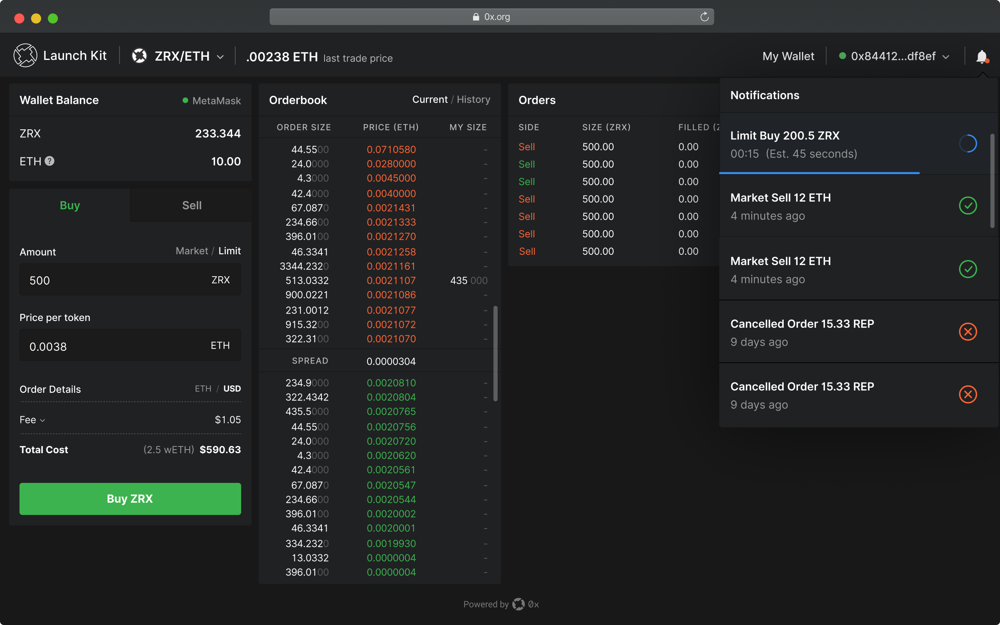
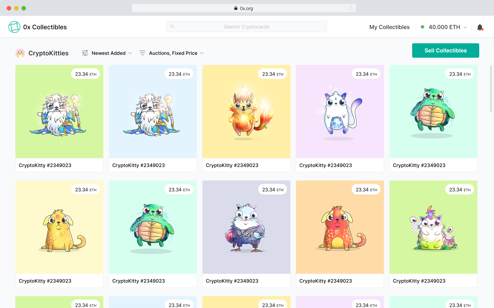

# 0x Launch Kit: Build an Exchange in Under a Minute 🚀📈

|     ERC-20     |     ERC-721     |
| :------------: | :-------------: |
|  |  |

## Quick Start

0x Launch Kit is the easiest way to create your own 0x-based cryptoasset exchange. Use one of our beautifully-crafted UIs as is, edit one to meet your needs, or build your own, all using our professionally-engineered backend to manage, validate, and serve 0x orders.

Need help or have questions? [Join our Discord](https://discordapp.com/invite/Xv45HzV)

### [Live Demo](https://demo.0x.org/erc20/)

#### Pre-requirements

-   [Node.js](https://nodejs.org/en/download/) > v8.x
-   [Yarn](https://yarnpkg.com/en/) > v1.x
-   [Docker](https://docs.docker.com/compose/install/)
-   [npx](https://www.npmjs.com/package/npx)

1. Run the wizard and load the Docker image

```
npx @0x/0x-launch-kit-wizard && docker-compose up
```

2. When Docker is done loading, open your browser to check out your new exchange. It will be running at the port you specified in the wizard (default is http://localhost:3001/)

[Instructions for using Launch Kit with Ganache](https://hackmd.io/-rC79gYWRyG7h6M9jUf5qA)

## Table of contents

-   [Introduction](#introduction)
-   [Language choice](#language-choice)
-   [Legal Disclaimer](#legal-disclaimer)

## Introduction

Launch a 0x relayer in under a minute with Launch Kit. This repository contains an open-source, free-to-use 0x relayer template that you can use as a starting point for your own project.

-   Quickly launch a market for your community token
-   Seemlessly create an in-game marketplace for digital items and collectibles
-   Enable trading of any ERC-20 or ERC-721 asset

Launch Kit is split into two separate repos:

-   **[0x Launch Kit Frontend](https://github.com/0xProject/0x-launch-kit-frontend)**: ERC-20 and ERC-721 relayer UIs
-   **[0x Launch Kit Backend](https://github.com/0xProject/0x-launch-kit-backend)**: 0x relayer server, API, and database that powers Launch Kit

This repo contains a Docker image that will run both codebases simultaneously for easy deployment, but you can also clone or fork each repo independently.

### [See website](https://0xproject.com/launch-kit)

## Language choice

`0x-launch-kit-backend` ships with 2 codebases, one in Typescript and another in Javascript. Although the Javascript is auto-generated from the Typescript, we made sure the Javascript generated is readable.

`0x-launch-kit-frontend` ship with just a TypeScript codebase and uses React + Thunk to create and manage the UI.

## Legal Disclaimer

The laws and regulations applicable to the use and exchange of digital assets and blockchain-native tokens, including through any software developed using the licensed work created by ZeroEx Intl. as described here (the “Work”), vary by jurisdiction. As set forth in the Apache License, Version 2.0 applicable to the Work, developers are “solely responsible for determining the appropriateness of using or redistributing the Work,” which includes responsibility for ensuring compliance with any such applicable laws and regulations.
See the Apache License, Version 2.0 for the specific language governing all applicable permissions and limitations: http://www.apache.org/licenses/LICENSE-2.0
