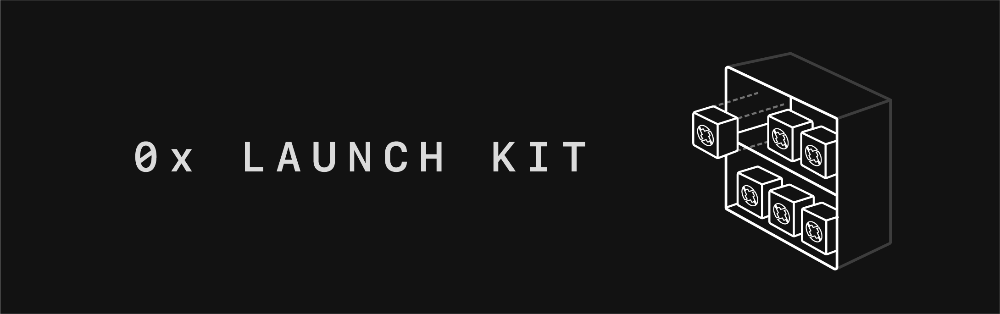

## Table of contents

-   [Introduction](#introduction)
-   [Language choice](#language-choice)
-   [Getting started](#getting-started)
-   [Client for your relayers API](#client-for-your-relayers-api)
-   [Commands](#commands)
-   [Database](#database)
-   [Deployment](#deployment)
-   [Legal Disclaimer](#legal-disclaimer)

## Introduction

Launch a 0x relayer in under a minute with Launch Kit. This repository contains an open-source, free-to-use 0x relayer template that you can use as a starting point for your own project.

-   Quickly launch a market for your community token
-   Seemlessly create an in-game marketplace for digital items and collectibles
-   Enable trading of any ERC-20 or ERC-721 asset

Fork this repository to get started!

### [See website](https://0xproject.com/launch-kit)

## Language choice

`0x-launch-kit` ships with 2 codebases, one in Typescript and another in Javascript. Although the Javascript is auto-generated from the Typescript, we made sure the Javascript generated is readable.

Before you start using `0x-launch-kit`, choose whether you want your codebase to be in Typescript or Javascript.

**If you want to work in Javascript:**

-   delete the `ts` directory
-   delete all scripts from `package.json` that end with `:ts`

Note: If you also wish to build and use the Docker image, please update the command in the Dockerfile to `CMD [ "forever", "js/index.js" ]`

**If you want to work in Typescript:**

-   delete the `js` directory
-   delete all scripts from `package.json` that end with `:js`

## Getting started

#### Pre-requirements

-   [Node.js](https://nodejs.org/en/download/) > v8.x
-   [Yarn](https://yarnpkg.com/en/) > v1.x

To develop ontop of `0x-launch-kit`, follow the following instructions:

1. Fork this repository

2. Clone your fork of this repository

3. Open the `config.ts`/`config.js` file (depending on the language you've chosen above) and edit the whitelisted tokens:

    - `WHITELISTED_TOKENS` -- Which tokens you would like to host orderbooks for.

4. Open the `.env` file and edit the following fields. Defaults are defined in `config.ts`/`config.js`. The bash environment takes precedence over the `.env` file. If you run `source .env`, changes to the `.env` file will have no effect until you unset the colliding variables.

    - `NETWORK_ID` -- the network you'd like your relayer to run on (e.g: `1` -> mainnet, `42` -> Kovan, 3 -> Ropsten, etc...)
    - `FEE_RECIPIENT` -- The Ethereum address which should be specified as the fee recipient in orders your relayer accepts. Defaults to a fake address that helps the 0x core team use anonymous, already public data to understand Launch Kit developer usage.
    - `MAKER_FEE_ZRX_UNIT_AMOUNT` -- The flat maker fee you'd like to receive for filled orders hosted by you
    - `TAKER_FEE_ZRX_UNIT_AMOUNT` -- The flat taker fee you'd like to receive for filled orders hosted by you.
    - `RPC_URL` -- Update with your node url. NOTE: Kovan doesn't work on INFURA with the current version of the OrderWatcher
    
    
[Instructions for using Launch Kit with Ganache](https://hackmd.io/-rC79gYWRyG7h6M9jUf5qA)

5. Make sure you have [Yarn](https://yarnpkg.com/en/) installed.

6. Install the dependencies:

    ```sh
    yarn
    ```

7. Build the project [This step is for Typescript users only]

    ```sh
    yarn build:ts
    ```

    or build & watch:

    ```sh
    yarn watch:ts
    ```

    **Note:** There isn't currently a build step when working on the Javascript codebase because we assume `0x-launch-kit` will be running on Node.js > v8.0. If you want this project to work in an environment that doesn't support many of the latest Javascript features, you will need to add a transpiler (e.g [Babel](https://babeljs.io/)) to this project.

8. Start the relayer

    ```sh
    yarn start:ts
    ```

    OR

    ```sh
    yarn start:js
    ```

## Client for your relayer's API

Since the `0x-launch-kit` relayer adheres to V2 of the [Standard Relayer API Specification](https://github.com/0xProject/standard-relayer-api/), you can use [0x Connect](https://0xproject.com/docs/connect) (an HTTP/Websocket client) to make calls to your relayer (e.g submit an order, get all orders, etc...)

Learn how to use 0x Connect to interact with your `0x-launch-kit` relayer in [this tutorial](https://0xproject.com/wiki#Find,-Submit,-Fill-Order-From-Relayer).

To quickly check if your relayer is up-and-running, send it this CURL request from the command-line:

```sh
curl http://localhost:3000/v2/orders
```

If everything is working as expected, you should see this response:

```
{
    "total": 0,
    "page": 0,
    "perPage": 20,
    "records": []
}
```

Since no orders have been added to your relayer yet, the `records` array is empty.

## Commands

Typescript project commands:

-   `yarn build:ts` - Build the code
-   `yarn lint:ts` - Lint the code
-   `yarn start:ts` - Starts the relayer
-   `yarn watch:ts` - Watch the source code and rebuild on change
-   `yarn prettier:ts` - Auto-format the code

Javascript project commands:

-   `yarn start:js` - Start the relayer
-   `yarn prettier:js` - Auto-format the code

## Database

This project uses [TypeORM](https://github.com/typeorm/typeorm). It makes it easier for anyone to switch out the backing database used by this project. By default, this project uses an [SQLite](https://sqlite.org/docs.html) database.

Because we want to support both Javascript and Typescript codebases, we don't use `TypeORM`'s [decorators](https://github.com/typeorm/typeorm/blob/master/docs/decorator-reference.md) (since they don't transpile nicely into readable Javascript). TypeORM shines with decorators however, so you might want to use them if you're going to be working in Typescript.

## Deployment

`0x-launch-kit` ships as a docker container. First, install Docker ([mac](https://docs.docker.com/docker-for-mac/install/), [windows](https://docs.docker.com/docker-for-windows/install/)). To build the image run:

```sh
docker build -t 0x-launch-kit .
```

You can check that the image was built by running:

```sh
docker images
```

And launch it with

```sh
docker run -p 3000:3000 -d 0x-launch-kit
```

Check that it's working by running

```
curl http://localhost:3000/v2/asset_pairs
```

## Legal Disclaimer

The laws and regulations applicable to the use and exchange of digital assets and blockchain-native tokens, including through any software developed using the licensed work created by ZeroEx Intl. as described here (the “Work”), vary by jurisdiction. As set forth in the Apache License, Version 2.0 applicable to the Work, developers are “solely responsible for determining the appropriateness of using or redistributing the Work,” which includes responsibility for ensuring compliance with any such applicable laws and regulations.
See the Apache License, Version 2.0 for the specific language governing all applicable permissions and limitations: http://www.apache.org/licenses/LICENSE-2.0
